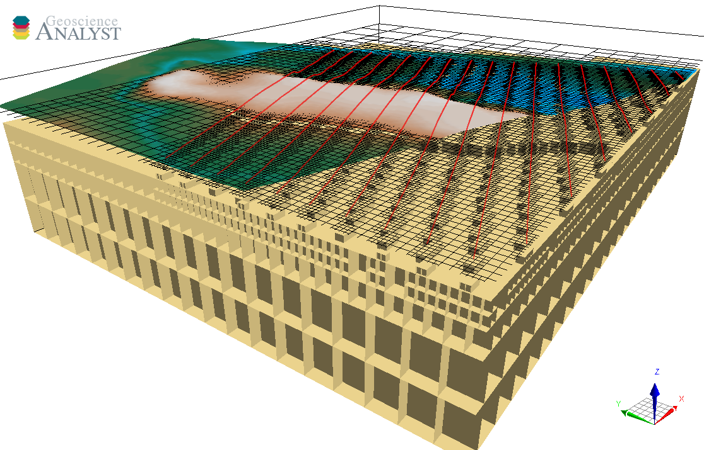

Octree Creation
===============

The ``Octree Creation`` application has been developed as a user-interface for the design of octree meshes with the
`discretize <https://discretize.simpeg.xyz/en/main/>`_ package.
The result is exported directly to ``geoh5`` format for visualization in
`Geoscience ANALYST <https://www.mirageoscience.com/mining-industry-software/geoscience-analyst/>`_.

The mesh generation is generally a required step in preparation for
`geophysical inversion <https://mirageoscience-geoapps.readthedocs-hosted.com/en/latest/content/applications/grav_mag_inversion.html>`_.

.. toctree::
   :maxdepth: 2

   getting_started
   usage
   methodology
