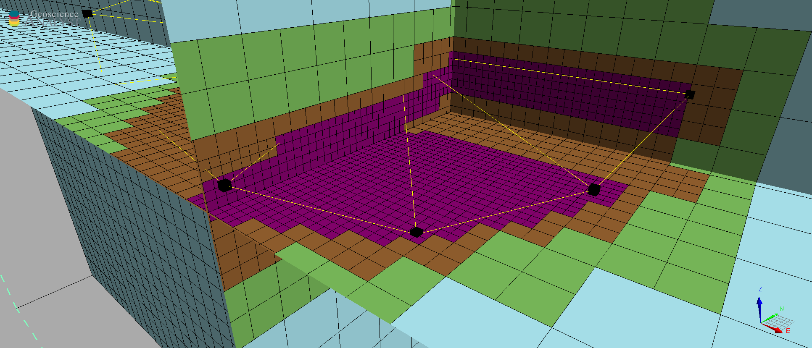

.. _methodology:

Methodology
===========

This section provides technical details regarding the algorithm used for the
creation octree meshes. The entire process can be broken down into two main parts:

- `Creating the base mesh (General Parameters) <mesh_creation>`_ that defines the outer extents and the core cell parameters.
- `Refinining the grid (Optional Parameters) <refinement>`_ to increase the resolution of the mesh in specific regions based on a set of rules.

.. _mesh_creation:

Creating the base
-----------------

This step relies on the
`discretize.utils.mesh_builder_xyz <http://discretize.simpeg.xyz/en/main/api/generated/discretize.utils.mesh_builder_xyz.html?highlight=xyz#discretize-utils-mesh-builder-xyz>`_
method to create the base mesh (single large box). The following general parameters provide controls on the position and
outer limits of the mesh.

.. figure:: /images/extent_parameters.png
    :width: 800

- **Core hull extent**:

    List of objects available in the target ``geoh5`` project. The base mesh will be centered on the
    selected object and extend beyond its hull.

- **Minimum depth**:

    Thickness of the mesh added below the core region. This is useful to ensure
    a minimum thickness of the mesh that extends below the lowest point of the input object.

- **Core cell size**:

    - *Easting (m)*: Smallest cell size along X-axis, in meters.
    - *Northing (m)*: Smallest cell size along Y-axis, in meters.
    - *Vertical (m)*: Smallest cell size along Z-axis, in meters.

- **Padding distance**:

    - *Horizontal (m)*: Distance to extend the mesh along the XY-plane.
    - *Vertical (m)*: Distance to extend the mesh above and below the core + minimum depth.

    .. note::
        Setting the *vertical padding = 0* will place the top of the mesh at the highest elevation of **Core hull extent** object.
        This is useful for creating a mesh that minimizes the amount of air cells.

.. _mimimum_refinement:

- **Minimum Refinement**:

    Largest octree level allowed after refinement.
    The equivalent cell dimension is given by:

    .. math::

        h \times 2^{level - 1}

    where *h* is the *core cell size* in a given direction.

Example
^^^^^^^

The example below demonstrates this process with simple line survey shown below and the following parameters:

.. image:: images/octree_padding_distance.png
    :width: 800
    :alt: paddings

Horizontal extent
#################

    - Input:
        - 5,600 m (survey hull)
        - 2 * 1,000 m (padding distance)

        **Total: 7,600 m**

    - Number of cells:

        .. math::

            \frac{7,600 \;m}{25 \; m/cell} = 304 \; cells \\

        **Round up -> 512 cells**

    - Final dimensions:

        .. math::

            512\;cells \times 25 \frac{m}{cell} = 12,800\;m

Vertical extent
###############

    - Input dimensions:
        - 46 m (survey hull)
        - 2*1000 m (vertical padding)
        - 500 m (depth core)

        **Total: 2,546 m**

    - Number of cells
        .. math::

            \frac{2546 \; m}{25\; \frac{m}{cell}} = 102\; cells \\

        **Round up -> 128 cells**

    - Final dimensions:
        .. math::

            128 \; cells \times 25 \frac{m}{cell} = 3,200\;m

Minimum refinement
##################

    - Input:
        - 25 m (core cell size)
        - 5 (minimum refinement)

    **Largest cell dimension**:

        .. math::

            25\;m \times 2^{(5-1)} = 400 m

The final mesh expected would be a 512 x 512 x 128 cells mesh, with an extent of 12,800 x 12,800 x 3,200 m. Note that the
cell size is uniform and equal to the minimum level of 5 (400 m cell size), as defined in the parameters.

.. _refinements:

Refinements
-----------

Once the extent of the mesh has been defined, the user can increase the resolution (add small cells) in specific regions of the mesh
based on a set of rules. In regions where no refinement is provided, the cell size will double in size until reaching
the `minimum refinement <minimum_refinement>`_ level. Up to three refinement strategies can be applied to the mesh.
For every refinement strategy, the user must specify the following parameters:

- **Object**:
    Geoh5 entity to be used for refinement. The type of the object dictates the method of refinement.
        - **Points** -> Add concentric shells of cells around each vertices.

            Uses the `refine_tree_from_points <refine_points>`_ method.
        - **Curve** -> Add concentric cylinders of cells around each segment of the curve.

            Uses the `refine_tree_from_curve <refine_curve>`_ method.
        - **Surface** -> Refine the mesh on the faces of a triangulated surface in 3D.

            Uses the `refine_tree_from_triangulation <refine_triangulation>`_ method.

- **Levels**:
    List of integers defining the number of cells requested at each octree level.

    .. math::
        [1^{st}, 2^{nd}, 3^{rd}, ...]

- [Optional] **Define as horizon**:
    If checked, the object will be used to define a horizon. The vertices of the object are used to first
    create a Delaunay surface, which is then used to refine the mesh as layers of cells below the surface.
    Uses the `refine_tree_from_surface <refine_surface>`_ method.

    - **Maximum distance**:
        Maximum distance from the object's node to allow refinement.
        Cells are allowed to expand in size beyond this distance.

.. _refine_points:

Refine by points
^^^^^^^^^^^^^^^^

This method refines an octree mesh radially from the vertices of an object. It relies on the ``refine_tree_from_points`` method

.. automethod:: octree_creation_app.driver.OctreeDriver.refine_tree_from_points

Example
#######

In the example below, the mesh is refined from the vertices of Points object. The parameters are as follows:

.. image:: images/octree_radial.png
  :width: 800
  :alt: radial

This results in a mesh that has 4 concentric shells of cells at 25 m, followed by 4 cells at 50 m around each vertex.
Note that the refinement is continuous only at the 2th octree level (50 m) where the refinements overlap.

.. _refine_curve:

Refine by curves
^^^^^^^^^^^^^^^^

This method refines an octree mesh along the segments of a ``Curve`` object, adding cells as concentric cylinders (tubes).

.. automethod:: octree_creation_app.driver.OctreeDriver.refine_tree_from_curve

Example
#######

In the example below, the mesh is refined along a closed curve. The parameters are as follows:

This results in a mesh with 4 concentric cylinders of cells at 25 m, followed by 4 cells at 50 m.
Note that the refinement is continuous along the segments of the curve.

.. _refine_triangulation:

Refine by surface
^^^^^^^^^^^^^^^^^

The function is used to refine an octree mesh on a triangulated surface in 3D. It is
especially useful for refining meshes along geological features, such as faults and geological contacts.

.. automethod:: octree_creation_app.driver.OctreeDriver.refine_tree_from_triangulation

Example
#######

In the example below, the mesh is refined around a spherical shell. The parameters are as follows:

.. image:: images/octree_surface.png
  :width: 800
  :alt: radial

This results in shell of 4 cells at 25 m, surrounded by a shell of 4 cells at 50 m. Note that the
refinement is continuous along the faces of the triangulated surface.

.. _refine_surface:

Refine by layers
^^^^^^^^^^^^^^^^

This method refines an octree mesh along a surface layer, or horizon. It is a faster
implementation then the `Refine by surface <_refine_triangulation>`_ method, but it assumes the surface
to be mostly horizontal (z-normal only). It is especially useful for refining meshes along topography.

.. automethod:: octree_creation_app.driver.OctreeDriver.refine_tree_from_surface

Example
#######

In the example below, the mesh is refined along horizons defined by the vertices of Points object.
The parameters are as follows:

This results in a mesh that has 4 layers of cells at 25 m, followed by 4 cells at 50 m below the input vertices.
Note that the refinement follows the change in elevation of the input vertices.
