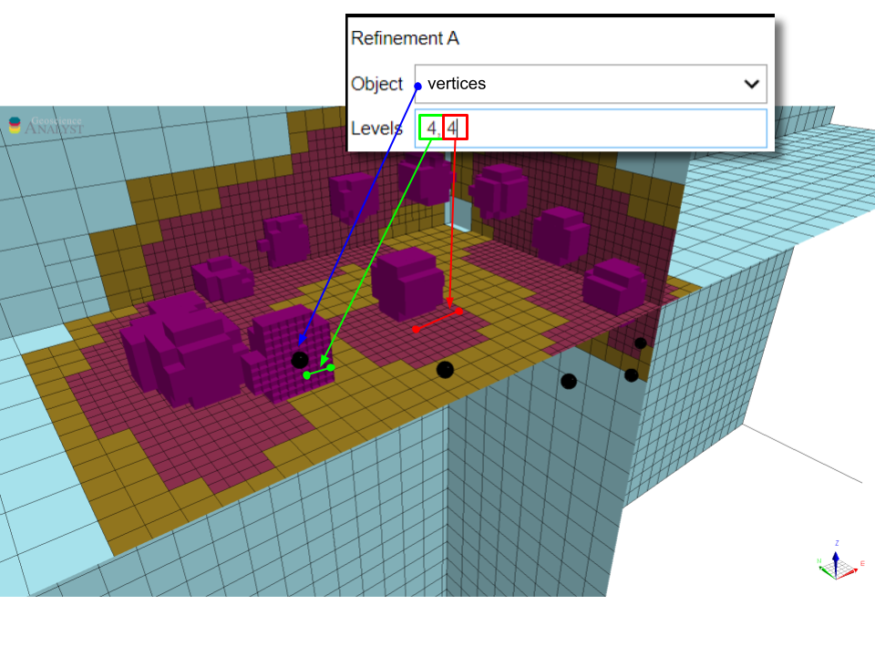

.. _methodology:

Methodology
===========

This section provides technical details regarding the algorithm used for the
creation and refinement of octree meshes.

This section provides algorithmic details about the mesh creation. The entire process can be broken down into three main parts:

.. _mesh_creation:

Mesh creation parameters
------------------------

The first stage relies on the `discretize.utils.mesh_builder_xyz <http://discretize.simpeg.xyz/en/main/api/generated/discretize.utils.mesh_builder_xyz.html?highlight=xyz#discretize-utils-mesh-builder-xyz>`_
method to define the outer limits of the mesh.

The general parameters control the core parameters that define the position and extent of mesh.

.. figure:: /images/ui_json.png
    :scale: 40%

Core hull extent
^^^^^^^^^^^^^^^^
List of objects available to define the core region extent.

Core cell size
^^^^^^^^^^^^^^
- *Easting (m)*: Smallest cell size along East-West axis, in meters.
- *Northing (m)*: Smallest cell size along North-South axis, in meters.
- *Vertical (m)*: Smallest cell size along vertical acis, in meters.

Depth Core
^^^^^^^^^^
Thickness of the mesh added below the lowest point of the

Minimum Refinement
^^^^^^^^^^^^^^^^^^
Largest octree level allowed after refinement.
The equivalent cell dimension =

.. math::

    h \times 2^{level}

where $h$ are the *core cell size*

The example below demonstrates this process with the default parameters:

**Horizontal extent (East-West):**

    Input: 5600 m (hull) + 2*1000 m (pad) = 7600 m

    Round: 7600 m / 25 m/cell = 304 cells -> 512 cells

    Final: 512 cells * 25 m/cell = 12800 m

**Vertical extent:**

    Input: 46 m (hull) + 2*1000 m (pad) + 500 (core) m = 2546 m

    Round: 2546 m / 25 m/cell = 102 cells -> 128 cells

    Final: 128 cells * 25 m/cell = 3,200 m

.. _refinements:

Refinements
-----------

Once the extent of the mesh has been defined, the program can proceed with refinement of the mesh.
The following section describe the different refinement strategies available.

Refine from points
------------------

.. automethod:: octree_creation_app.driver.OctreeDriver.refine_tree_from_points

This method refines an octree mesh radially from the vertices of an object.

Refine from curve
-----------------

.. automethod:: octree_creation_app.driver.OctreeDriver.refine_tree_from_curve

This method refines an octree mesh along the segments of a curve object.

Refine from surface
-------------------

.. automethod:: octree_creation_app.driver.OctreeDriver.refine_tree_from_surface

This method refines an octree mesh along a surface. It is a faster
implementation then the `Refine from triangulation`_ method, but it assumes the surface
to be mostly horizontal (z-normal). It is especially useful for refining meshes along topography.

Refine from triangulation
-------------------------

.. automethod:: octree_creation_app.driver.OctreeDriver.refine_tree_from_triangulation

The function is used to refine an octree mesh on a triangulated surface in 3D. It is
especially useful for refining meshes along geological features, such as faults and geological contacts.
