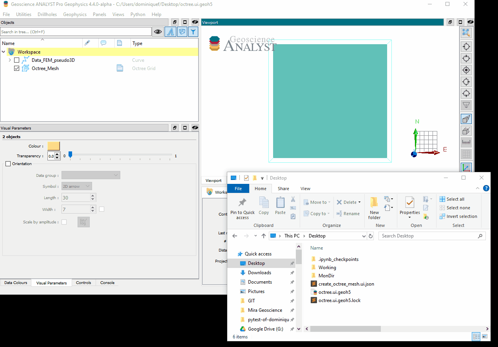

.. _usage:

Basic usage
===========

The main entry point is the ui.json (stored under ``assets``) for the octree-creation application that can be rendered
by Geoscience ANALYST. The interface has two sections described in the :ref:`Methodology <methodology>` section:

 - :ref:`Mesh creation parameters <mesh_creation>`
 - :ref:`Refinement parameters <refinements>`

.. figure:: /images/ui_json.png
    :scale: 40%

To execute the application in ANALYST Pro, users can either drag-and-drop the ui.json file to the viewport:

Alternatively, users can add the application to the choice list of ANALYST-Python scripts:

.. figure:: ./images/dropdown.gif
        :align: center
        :width: 800

Note that ANALYST needs to be restarted for the changes to take effect.

Either operation will result in the rendering of a ui.json file within the Geoscience ANALYST viewport.
To learn more about the ui.json interface visit `UIJson documentation <https://geoh5py.readthedocs.io/en/v0.8.0-rc.1/content/uijson_format/usage.html#usage-with-geoscience-analyst-pro>`_ page.

From command line
-----------------

The application can also be run from the command line.  This is useful for more advanced users that may want to automate
the mesh creation process, or re-run an existing mesh with different parameters.  To run the application from the command line,

``python -m octree_creation_app.driver input_file.json``

where ``input_file.json`` is the path to the input file.
